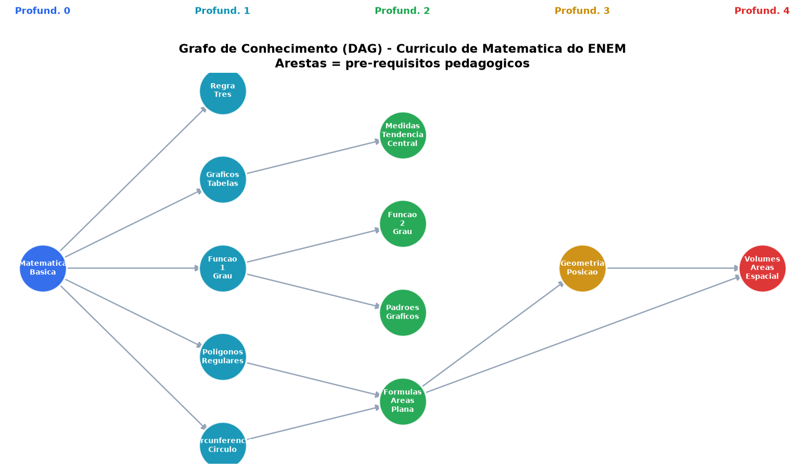
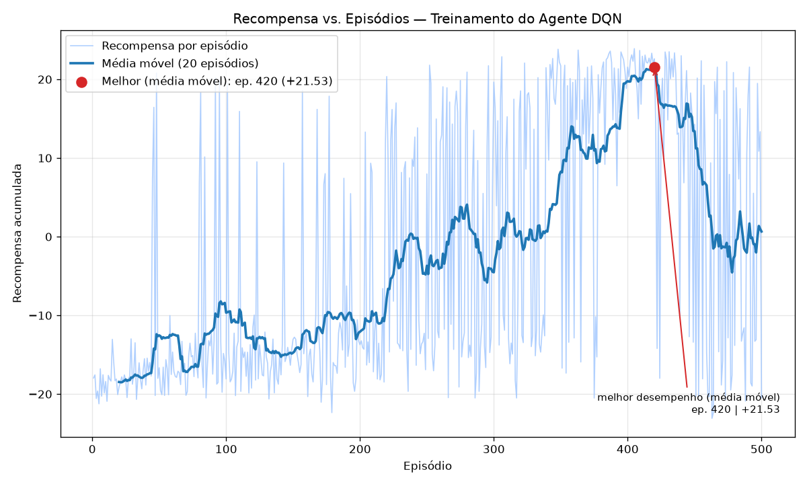
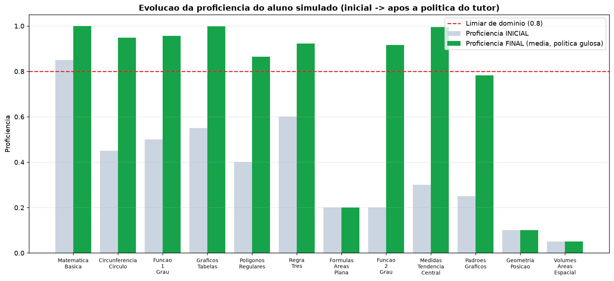

# Relatório Técnico — Sistema Tutor Inteligente (ITS) com Aprendizado por Reforço

**Projeto:** `enem-rl-tutor` — Tutor adaptativo de Matemática para o ENEM
**Branch:** `refatoracao` (implementação de referência / baseline estável)
**Algoritmo:** Deep Q-Network (DQN)

---

## 1. Sumário executivo

Este projeto modela um **Sistema Tutor Inteligente (ITS)** como um problema de
**Aprendizado por Reforço (RL)**: em vez de recomendar produtos para maximizar
cliques, o agente recomenda **trilhas de questões para maximizar o aprendizado**,
conduzindo o aluno do nível básico ao avançado dentro de um currículo de
Matemática do ENEM.

O ambiente é o **modelo cognitivo do aluno**; o agente é o **modelo pedagógico**.
A implementação de referência (`refatoracao`) entrega um agente DQN que:

- **aprende uma política pedagógica coerente** (avalia, consolida e avança no
  currículo, respeitando pré-requisitos);
- leva o aluno simulado a **dominar ~8,7/12 conceitos (≈73% do currículo)**,
  atingindo o "nível avançado" em **~93% das execuções** (média de 3 treinos);
- inverte o quadro inicial em que o treinamento **não aprendia nada** (recompensa
  travada em ~0): hoje a recompensa cresce de forma sustentada.

O documento descreve o domínio, a formulação como MDP, a implementação, o
**parecer sobre a linha de pensamento** (o diagnóstico que reescreveu o ambiente)
e os **resultados**, encerrando com **limitações e trabalhos futuros**.

---

## 2. Domínio e escopo

### 2.1 O problema pedagógico

O objetivo é manter o aluno na **Zona de Desenvolvimento Proximal (ZDP)** —
questões nem fáceis demais (tédio/desperdício) nem difíceis demais (frustração) —
e fazê-lo **evoluir** até conceitos avançados, evitando que fique preso no fácil.
Fundamentos teóricos incorporados: ZDP (Vygotsky), Teoria de Resposta ao Item
(TRI) e Modelo Aberto do Aluno.

### 2.2 O Modelo de Domínio — Grafo de Conhecimento (DAG)

O currículo é um **Grafo Direcionado Acíclico** `G = (V, E)`: os vértices são
conceitos e as arestas são **pré-requisitos** (`v_i → v_j` ⇒ dominar `v_i` é
necessário para aprender `v_j`). A implementação usa 12 conceitos em 5 níveis de
profundidade:



A profundidade no DAG é o **eixo de evolução**: o "nível avançado" corresponde a
dominar os conceitos profundos (ex.: `Volumes_Areas_Espacial`, profundidade 4),
que exigem a cadeia completa de pré-requisitos.

---

## 3. Formulação como MDP

A tabela abaixo mapeia os elementos do domínio para o Processo de Decisão de
Markov implementado (alinhado ao documento de concepção do projeto):

| Elemento RL | Implementação no ITS |
|---|---|
| **Ambiente** | Modelo cognitivo do aluno simulado (`StudentEnvironment`) |
| **Estado `S`** | Vetor de **proficiências por conceito (12)** ⊕ **one-hot do conceito atual (12)** → `dim_estado = 24` |
| **Ações `A`** | 3 intervenções pedagógicas: **Avançar** (sucessor no DAG), **Reforçar** (mesmo conceito), **Remediar** (pré-requisito) |
| **Transição** | Atualização da proficiência (sobe ao acertar, cai ao errar), **escalada pelo domínio dos pré-requisitos** |
| **Recompensa `R`** | Orientada à meta (ver §3.1) |
| **Algoritmo** | Deep Q-Network (estado contínuo + ações discretas) |

### 3.1 Função de recompensa

A recompensa foi projetada para **guiar o agente ao comportamento ótimo** —
levar o aluno ao nível avançado — e não apenas a "manter na ZDP":

```
R_t = W_PROGRESSO · Δprof · peso_profundidade     (ganho de aprendizado, ponderado por profundidade)
    + bônus de domínio                            (1ª vez que um conceito cruza o limiar τ = 0,8)
    − W_ZDP · |ŷ − 0,5|                            (mantém na Zona de Desenvolvimento Proximal)
    − W_PASSO                                      (custo por passo → eficiência)
    + W_OBJETIVO                                   (bônus terminal ao atingir o nível avançado)
```

| Parâmetro | Valor | Papel |
|---|---|---|
| `W_PROGRESSO` | 4,0 | Recompensa densa pelo ganho de proficiência (mais peso em conceitos profundos) |
| `W_DOMINIO` | 1,5 | Bônus por **dominar** um conceito novo |
| `W_ZDP` | 0,20 | Penalidade por sair da ZDP |
| `W_PASSO` | 0,01 | Eficiência (evita enrolar) |
| `W_OBJETIVO` | 15,0 | Bônus terminal |
| `τ` (limiar de domínio) | 0,80 | Proficiência a partir da qual há "domínio" |
| Meta | 70% | Fração do currículo dominada = "nível avançado" |

A probabilidade de acerto segue uma **logística estilo TRI**:
`ŷ = σ(k·[(prof − dificuldade) + α·(domínio_dos_pré-requisitos − 0,5)])`, de modo
que pré-requisitos fracos derrubam `ŷ` — é isso que dá sentido pedagógico a
"Remediar" e cria a dinâmica de currículo.

---

## 4. Arquitetura da implementação

```
enem-rl-tutor/
├── data/database_setup.py   # DAG + banco de questões em GRADE (conceito × dificuldade)
├── env/student_env.py       # Ambiente: Modelo do Aluno + dinâmica + recompensa
└── agent/
    ├── model.py             # Q-Network (MLP)
    ├── replay_buffer.py     # Experience Replay
    ├── dqn_agent.py         # Política ε-greedy, alvo de Bellman, soft update
    └── train.py             # Loop de treino + avaliação gulosa + checkpoint
```

| Componente | Técnica | Observação |
|---|---|---|
| Q-Network | MLP 24→128→128→3 (ReLU) | Saída = Q-value por ação |
| Experience Replay | Buffer circular (10k) | Quebra a correlação temporal |
| Target Network | **Soft update (Polyak), τ=0,005** | Anti-divergência ("curvas serrilhadas") |
| Exploração | ε-greedy (1,0 → 0,05) | Decaimento exponencial |
| Perda | Huber (SmoothL1) + clip de gradiente | Estabilidade |
| Seleção de checkpoint | **Melhor avaliação GULOSA (ε=0)** | A recompensa de treino com ε mascara colapsos |
| Banco de questões | Grade 12 conceitos × 3 níveis × 5 = **180 questões** | Parametrizadas e reprodutíveis |

---

## 5. Parecer — a linha de pensamento

A concepção original estava conceitualmente rica, mas a **modelagem do MDP
impedia o aprendizado**. O trabalho central foi diagnosticar e reescrever o
ambiente. Os cinco problemas e suas correções:

| # | Problema diagnosticado | Por que travava | Correção |
|---|---|---|---|
| 1 | **Recompensa `R_t = y − ŷ`** | Com `ŷ` calibrado, `E[R_t] = 0` para **qualquer** política → gradiente nulo. O aluno melhorar não aumentava a recompensa | Recompensa **orientada à meta**: ganho de aprendizado ponderado por profundidade + bônus de domínio + bônus terminal |
| 2 | **Estado não-Markoviano** | "Avançar/Reforçar/Remediar" dependem de *onde* o aluno está, mas o estado só tinha proficiências | **One-hot do conceito atual** no vetor de estado (`dim 12 → 24`) |
| 3 | **Ação não controlava o desafio** | A questão era "casada" com a proficiência, fixando `ŷ ≈ 0,5` e neutralizando a ação | A dificuldade passa a vir do **conceito-alvo** escolhido pela ação |
| 4 | **Treino não-episódico** | A proficiência era persistida no banco a cada passo → não-estacionário e irreprodutível | Proficiência **em memória**; `reset()` restaura o estado inicial |
| 5 | **Sem meta nem acoplamento de pré-requisitos** | `done` só por fadiga; nada puxava ao avançado | **Bônus terminal** + sucesso/aprendizado **acoplado ao domínio dos pré-requisitos** + navegação determinística no DAG |

Correções de engenharia adicionais: **soft update** da target network
(estabilização exigida no projeto), **checkpoint pela avaliação gulosa** (a
recompensa de treino mascarava políticas que colapsam no modo guloso), **banco
de questões em grade** e correção do `.gitignore` (a regra padrão `env/`
escondia o pacote-fonte do ambiente).

> **Parecer:** o gargalo nunca foi o algoritmo (DQN), e sim a **modelagem do
> problema**. Uma recompensa de média zero é a falha mais sutil e mais fatal:
> o treino "roda", a perda parece comportada, mas a curva de recompensa fica
> plana em ~0 porque não há nada para maximizar. Corrigida a modelagem, o mesmo
> DQN passou a aprender uma política pedagógica sensata.

---

## 6. Resultados

### 6.1 Curva de aprendizado

Após as correções, a recompensa acumulada **cresce de forma sustentada** ao longo
dos episódios (antes: plana em ~0, sem tendência):



### 6.2 Evolução do aluno

A política gulosa **eleva substancialmente a proficiência** do aluno simulado,
levando a maioria dos conceitos acima do limiar de domínio (linha tracejada):



A figura também expõe, com honestidade, a principal **limitação** do baseline: a
cadeia profunda de geometria (`Formulas_Areas_Plana → Geometria_Posicao →
Volumes_Areas_Espacial`) permanece **não dominada** — o agente raramente a
alcança, pois ela exige a satisfação simultânea de dois pré-requisitos. O aluno
chega ao "nível avançado" pelos ramos de funções/estatística e geometria rasa,
mas não pela folha mais profunda. Isso conecta-se diretamente à limitação do
espaço de ações relativo (§7.2).

### 6.3 Métricas (política gulosa, ε=0)

| Métrica | Valor |
|---|---|
| Conceitos dominados (real) | **~8,7 / 12 (≈73% do currículo)** |
| Taxa de "nível avançado" (≥70% dominado) | **~93%** (média de 3 execuções; ver §6.4) |
| Perda de treino (estável) | ~0,11 |
| Distribuição de ações | Avançar 51% · Reforçar 28% · Remediar 21% |

A política usa as **três intervenções**: avança pelo currículo (Avançar),
consolida conceitos (Reforçar) e recua para reforçar pré-requisitos fracos
(Remediar) — respeitando o DAG e mantendo o aluno majoritariamente na ZDP. O
padrão típico é de **avaliação/avanço seguido de consolidação** até cruzar a
fração-alvo de domínio.

### 6.4 Robustez entre execuções

Treinando do zero 3 vezes e avaliando cada política (20 episódios gulosos):

| Execução | Nível avançado | Conceitos dominados |
|---|---|---|
| 1 | 100% | 9,0 / 12 |
| 2 | 95% | 8,7 / 12 |
| 3 | 85% | 8,4 / 12 |
| **Média** | **93%** | **8,7 / 12** |

O desempenho é consistentemente alto (**85–100%**), mas a **variância entre
execuções** é real — sintoma da instabilidade de métodos baseados em valor (a
curva de treino oscila, como se vê em §6.1). O *checkpoint da melhor avaliação
gulosa* é o que garante extrair uma boa política mesmo com a oscilação; ainda
assim, execuções pontuais podem cair abaixo dessa faixa (ver limitação 1 em §7).

---

## 7. Limitações

1. **Variância de treino (instabilidade do DQN).** Métodos baseados em valor
   oscilam; execuções diferentes do mesmo código chegam a políticas de qualidade
   distinta. Mitigado por *soft update* + *checkpoint* da melhor avaliação
   gulosa, mas não eliminado.
2. **Espaço de ações relativo (3 verbos).** O agente escolhe o *conceito* mas
   **não a dificuldade da questão**. Ao chegar num conceito intrinsecamente
   difícil, seu único recurso é repetir — e, como errar reduz a proficiência,
   a repetição pode **piorar** o aluno (zona de frustração) em vez de adaptar.
3. **Domínio-brinquedo.** 12 conceitos, 1 aluno simulado e **180 questões
   sintéticas** (parametrizadas). Suficiente para validar a modelagem, insuficiente
   para um produto real.
4. **Estado totalmente observável.** O baseline assume que o sistema conhece a
   proficiência verdadeira do aluno — irreal num tutor de produção.
5. **Aluno simulado, não real.** A dinâmica de aprendizado/esquecimento é uma
   aproximação; não foi validada contra dados de estudantes reais.

---

## 8. Trabalhos futuros

As linhas abaixo foram exploradas em **branches separadas** durante o projeto e
ficam documentadas como caminhos validados (ou descartados) para evolução:

| Direção | Status | Resultado |
|---|---|---|
| **Modelo de crença (BKT) + sondagem por ganho de informação** | ✅ implementado (branch `sondagem`) | O sistema deixa de observar a verdade e passa a manter uma crença Bayesiana (média + incerteza); a recompensa de **sondagem** premia *descobrir* domínio oculto. Recupera a meta (**~90%**) e adiciona avaliação ativa — tornando o estado parcialmente observável tratável via estado-de-crença. |
| **Espaço de ações `A = V × D` (conceito × dificuldade)** | ⚠️ testado e descartado (branch `acao-vxd`) | Dá controle fino da dificuldade (fecharia a limitação 7.2), mas o espaço de **36 ações** é difícil demais para DQN: o treino **diverge** (perda → 2,5). Nem **Double DQN** resgatou (estabilizou a perda, mas a meta seguiu ~0%). Conclusão: exige um motor de RL diferente (**PPO/A2C**). |
| **Persistência da crença entre sessões** | proposto | Hoje a crença reinicia a cada episódio; um tutor real acumularia conhecimento sobre o aluno ao longo do tempo. |
| **Dados reais do ENEM** | proposto | Substituir questões sintéticas por itens reais com dificuldade TRI; reservar um conjunto de avaliação. |
| **Múltiplos perfis de aluno** | proposto | Treinar contra "bots" variados (chutador, consistente, esquecido) para uma política robusta. |
| **Dashboard (Modelo Aberto do Aluno)** | proposto | Expor o estado de crença ao estudante para promover metacognição. |

> **Síntese das explorações:** cada salto de expressividade do modelo exigiu um
> aprendiz mais forte. O baseline (`refatoracao`) é o ponto de equilíbrio
> estável; o **modelo de crença** (`sondagem`) é uma evolução **validada** e
> recomendada; o **`V × D`** é o desenho conceitualmente ideal, mas que **só vive
> com policy-gradient** (PPO), não com DQN.

---

## 9. Conclusão

O projeto demonstra, de ponta a ponta, que **modelar corretamente o MDP** é o que
torna um ITS por RL viável. A contribuição central não foi um truque de algoritmo,
mas o **diagnóstico de que a recompensa original tinha média zero** e a sua
reescrita orientada à meta, somada às correções de estado markoviano, treino
episódico e acoplamento de pré-requisitos. O resultado é um agente que aprende
uma **política pedagógica coerente com o domínio** — avalia, respeita
pré-requisitos, mantém o aluno na ZDP e o conduz ao nível avançado.

---

## Apêndice — Como reproduzir

```bash
pip install -r requirements.txt
python -m data.database_setup     # cria o DAG + banco de questões em grade
python -m agent.train             # treina; salva pesos e a curva de aprendizado
```

Saídas: `data/weights/dqn_policy.pt` (melhor política) e
`data/weights/recompensa_vs_episodios.png` (curva de aprendizado).
Figuras deste relatório: `docs/figuras/`.
