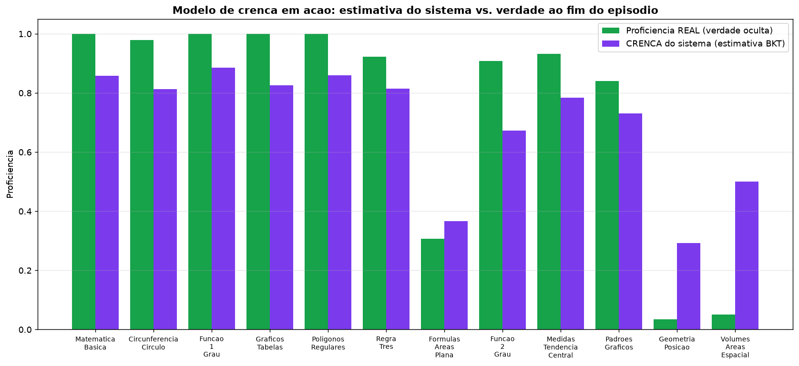

# Relatório Técnico — Sistema Tutor Inteligente (ITS) com Aprendizado por Reforço

**Projeto:** `enem-rl-tutor` — Tutor adaptativo de Matemática para o ENEM
**Algoritmo:** Deep Q-Network (DQN) sobre um MDP de estado-de-crença

---

## 1. Sumário executivo

O projeto modela um **Sistema Tutor Inteligente (ITS)** como um problema de
**Aprendizado por Reforço (RL)**: em vez de recomendar produtos para maximizar
cliques, o agente recomenda **trilhas de questões para maximizar o aprendizado**,
conduzindo um aluno do nível básico ao avançado dentro de um currículo de
Matemática do ENEM.

A implementação tem três pilares:

1. um **simulador do aluno** (o ambiente), que mantém a proficiência real do
   estudante e a faz evoluir conforme ele acerta/erra;
2. um **modelo de crença Bayesiano**, pelo qual o sistema **não conhece** a
   proficiência verdadeira do aluno — ele a **estima com incerteza**, atualizando
   a estimativa a cada resposta (como um tutor real faz);
3. um **agente DQN**, que aprende a política pedagógica: a cada passo escolhe
   **avaliar, consolidar ou recuar** no grafo de conhecimento.

Resultados (política gulosa): **~88% de "nível avançado"** (média de 3 treinos;
70–100%), **~8,8/12 conceitos dominados**, e — o diferencial pedagógico —
**~68% das "sondagens"** (testar um conceito sobre o qual o sistema tem dúvida)
**revelam domínio oculto**, reduzindo o erro da estimativa. O ponto central deste
relatório é que tudo isso foi obtido **corrigindo a modelagem do problema**, não
trocando de algoritmo.

---

## 2. Domínio e escopo

### 2.1 O problema pedagógico

O objetivo é manter o aluno na **Zona de Desenvolvimento Proximal (ZDP)** —
questões nem fáceis demais (tédio/desperdício) nem difíceis demais (frustração) —
e fazê-lo **evoluir** até conceitos avançados, evitando que fique preso no fácil.
Fundamentos teóricos incorporados: ZDP (Vygotsky), Teoria de Resposta ao Item
(TRI) e Modelo Aberto do Aluno.

### 2.2 O Modelo de Domínio — Grafo de Conhecimento (DAG)

O currículo é um **Grafo Direcionado Acíclico** `G = (V, E)`: os vértices são
conceitos e as arestas são **pré-requisitos** (`v_i → v_j` ⇒ dominar `v_i` é
necessário para aprender `v_j`). A implementação usa 12 conceitos em 5 níveis de
profundidade:


A profundidade no DAG é o **eixo de evolução**: o "nível avançado" corresponde a
dominar os conceitos profundos (ex.: `Volumes_Areas_Espacial`, profundidade 4),
que exigem a cadeia completa de pré-requisitos.

---

## 3. Formulação como MDP

| Elemento RL | Implementação no ITS |
|---|---|
| **Ambiente** | Simulador do aluno com proficiência **REAL oculta** |
| **Estado `S`** (observado) | **Estimativa de proficiência (12)** ⊕ **one-hot do conceito atual (12)** ⊕ **incerteza da estimativa (12)** → `dim_estado = 36` |
| **Ações `A`** | 3 intervenções pedagógicas: **Avançar** (sucessor no DAG), **Reforçar** (mesmo conceito), **Remediar** (pré-requisito) |
| **Transição** | O aluno aprende (proficiência REAL muda) **e** o sistema reavalia (a estimativa é atualizada) |
| **Recompensa `R`** | Orientada à meta + sondagem (§3.2) |
| **Algoritmo** | DQN (estado contínuo + ações discretas) |

### 3.1 Modelo de crença (estimativa + incerteza)

O sistema mantém, para cada conceito, uma **crença Bayesiana** sobre a
probabilidade de acerto, representada por uma distribuição **Beta(α, β)**:

- o aluno acerta segundo a **proficiência REAL** (oculta);
- o agente observa apenas a **média** `α/(α+β)` (estimativa) e o **desvio**
  (incerteza) dessa crença;
- a cada resposta a crença é atualizada (acerto → `+α`, erro → `+β`), com um leve
  esquecimento (`λ = 0,95`) que a faz **rastrear** um aluno que evolui.

Expor a **incerteza** (e não só a estimativa pontual) é o que torna a observação
uma **estatística suficiente** do estado — ver §5.3.

### 3.2 Função de recompensa

```
R_t = W_PROGRESSO · Δprof_real · peso_profundidade   (ganho de aprendizado, ponderado por profundidade)
    + bônus de domínio                                (1ª vez que um conceito cruza o limiar τ = 0,8)
    + W_SONDA · max(0, Δerro_crença)                  (SONDAGEM: ganho de informação)
    − W_TEDIO · max(0, ŷ − 0,85)                      (questão fácil demais → tédio/desperdício)
    − W_FRUST · max(0, 0,20 − ŷ)  [se errou]          (questão difícil demais → frustração)
    − W_PASSO                                         (custo por passo → eficiência)
    + W_OBJETIVO                                      (bônus terminal: nível avançado atingido)
```

| Parâmetro | Valor | Papel |
|---|---|---|
| `W_PROGRESSO` | 4,0 | Recompensa densa pelo ganho de proficiência (mais peso em conceitos profundos) |
| `W_DOMINIO` | 1,5 | Bônus por **dominar** um conceito novo |
| `W_SONDA` | 4,0 | **Ganho de informação**: quanto a resposta aproximou a estimativa da verdade |
| `W_TEDIO` / `W_FRUST` | 1,0 / 1,5 | Penalizam os extremos da dificuldade |
| `W_OBJETIVO` | 15,0 | Bônus terminal |
| `τ` / meta | 0,80 / 70% | Limiar de domínio / fração do currículo = "nível avançado" |

A probabilidade de acerto segue uma **logística estilo TRI**:
`ŷ = σ(k·[(prof − dificuldade) + α·(domínio_dos_pré-requisitos − 0,5)])` — de modo
que pré-requisitos fracos derrubam `ŷ`, dando sentido pedagógico a "Remediar".

---

## 4. O que foi implementado (código)

```
data/database_setup.py   # Schema (SQLAlchemy) + DAG + banco de questões em grade
env/student_env.py       # Simulador do aluno: proficiência REAL, crença, recompensa
agent/
  ├── model.py           # Q-Network (MLP)
  ├── replay_buffer.py   # Experience Replay
  ├── dqn_agent.py       # Política ε-greedy, alvo de Bellman, soft update
  └── train.py           # Loop de treino + avaliação gulosa + checkpoint
```

**`data/database_setup.py`** — define o schema relacional (conceitos, arestas de
pré-requisito, questões, estado do aluno, interações) e popula o banco:
- o **grafo de conhecimento** (`GRAFO_CONHECIMENTO`) como dicionário conceito →
  pré-requisitos, materializado em uma tabela associativa (DAG);
- um **banco de questões em grade** `conceito × dificuldade` (3 níveis), com
  questões **parametrizadas** (geradores que sorteiam números e calculam o
  gabarito) → 12 × 3 × 5 = **180 questões** reprodutíveis (semente fixa).

**`env/student_env.py`** — o ambiente, no estilo OpenAI Gym (`reset()` / `step()`):
- guarda a **proficiência REAL** do aluno (oculta) e a **crença** Beta(α, β) por
  conceito; `_get_state()` monta a observação `[estimativa, one-hot, incerteza]`;
- `step()` traduz a ação abstrata no conceito-alvo (navegação determinística pelo
  DAG), calcula `ŷ` (da crença) e a probabilidade real, **sorteia o resultado**,
  atualiza a proficiência real (`_atualizar_proficiencia`) e a crença
  (`_atualizar_crenca`), e calcula a recompensa (§3.2);
- a proficiência vive **em memória** e `reset()` a restaura → treino episódico e
  reprodutível.

**`agent/`** — o agente DQN e o treino:
- `model.py`: MLP `36 → 128 → 128 → 3` (ReLU), saída = Q-value por ação;
- `replay_buffer.py`: buffer circular que descorrelaciona as transições;
- `dqn_agent.py`: seleção **ε-greedy**, alvo de Bellman
  `r + γ·max_a' Q_target(s',a')·(1−done)`, perda **Huber** com clip de gradiente
  e **soft update (Polyak)** da target network;
- `train.py`: o laço de episódios, a **avaliação gulosa periódica** (ε=0) e o
  salvamento do **melhor checkpoint**, além da curva de aprendizado.

| Técnica de estabilização | Onde |
|---|---|
| Experience Replay | `replay_buffer.py` |
| Target Network — **soft update**, τ=0,005 | `dqn_agent.update_target` |
| Huber loss + clip de gradiente | `dqn_agent.optimize_model` |
| Seleção pela **avaliação gulosa** (não pela recompensa de treino) | `train.avaliar_politica` |

---

## 5. Parecer — a linha de pensamento

A concepção original do problema estava conceitualmente rica, mas a **modelagem
do MDP impedia o aprendizado**. O trabalho central foi diagnosticar e reescrever
o ambiente. Os problemas e as correções:

| # | Problema diagnosticado | Por que travava | Correção implementada |
|---|---|---|---|
| 1 | **Recompensa `R_t = y − ŷ`** | Com `ŷ` calibrado, `E[R_t] = 0` para **qualquer** política → gradiente nulo. O aluno melhorar não aumentava a recompensa | Recompensa **orientada à meta**: ganho de aprendizado ponderado por profundidade + bônus de domínio + bônus terminal |
| 2 | **Estado não-Markoviano** | "Avançar/Reforçar/Remediar" dependem de *onde* o aluno está, mas o estado só tinha proficiências | **One-hot do conceito atual** no vetor de estado |
| 3 | **Ação não controlava o desafio** | A questão era "casada" com a proficiência, fixando `ŷ ≈ 0,5` e neutralizando a ação | A dificuldade passa a vir do **conceito-alvo** escolhido pela ação |
| 4 | **Treino não-episódico** | A proficiência era persistida a cada passo → não-estacionário e irreprodutível | Proficiência **em memória**; `reset()` restaura o estado inicial |
| 5 | **Sem meta nem pré-requisitos** | `done` só por fadiga; nada puxava ao avançado | **Bônus terminal** + aprendizado **acoplado ao domínio dos pré-requisitos** |

### 5.1 Da observabilidade total à crença

As correções acima já produzem um tutor que aprende — mas que **conhece a verdade
sobre o aluno**, hipótese irreal. O passo seguinte foi **esconder a proficiência
real** e fazer o agente agir sobre uma **estimativa**. Isso introduziu a pergunta
pedagógica que guiou o resto do projeto:

> *"E se o agente testar uma questão mais difícil antes da proficiência exata,
> para descobrir se o aluno já não domina aquilo — recompensando essa
> descoberta?"*

A ideia é correta, mas só faz sentido quando a estimativa do sistema **pode
diferir** da verdade. Daí o **modelo de crença**: a recompensa de **sondagem**
premia **reduzir o erro da estimativa** (descobrir domínio oculto). Note que a
fórmula `y − ŷ`, inútil como objetivo (média zero), **renasce corretamente como
*shaping*** de ganho de informação sobre um objetivo direcional.

### 5.2 O insight central: estado-de-crença

Esconder a verdade torna o problema **parcialmente observável (POMDP)**. Uma
estimativa **pontual** não basta: a rede não distingue "estimativa baixa porque o
aluno é fraco" de "estimativa baixa por falta de evidência". A solução **não** foi
trocar de algoritmo (rede recorrente), e sim **expor a incerteza** junto da
estimativa. Estimativa + incerteza formam uma **estatística suficiente** da
crença, transformando o POMDP num **MDP de estado-de-crença** — e mantendo a
**DQN feedforward adequada**.

> **Parecer:** o gargalo do projeto nunca foi o algoritmo, e sim a **modelagem
> do problema**. A falha mais sutil e fatal foi a recompensa de média zero: o
> treino "rodava", a perda parecia comportada, mas a curva ficava plana em ~0
> porque não havia nada para maximizar. Corrigida a modelagem — e, depois,
> modelada a **incerteza** — o mesmo DQN simples passou a aprender uma política
> pedagógica coerente. Modelagem vencendo força bruta.

---

## 6. Resultados

### 6.1 Curva de aprendizado

Após as correções, a recompensa acumulada **cresce de forma sustentada** (antes:
plana em ~0, sem tendência); a perda de treino fica baixa e estável (~0,07):


### 6.2 Evolução do aluno (proficiência REAL)

A política gulosa **eleva substancialmente a proficiência real** do aluno
simulado, levando a maioria dos conceitos acima do limiar de domínio:


A figura também expõe, com honestidade, a principal limitação: a cadeia profunda
de geometria (`Formulas_Areas_Plana → Geometria_Posicao → Volumes_Areas_Espacial`)
permanece **não dominada** — exige a satisfação simultânea de dois pré-requisitos
(§7).

### 6.3 O modelo de crença em ação

Ao fim do episódio, a **estimativa do sistema (roxo)** acompanha a **proficiência
real (verde)** nos conceitos em que o agente atua — o sistema **aprendeu o
aluno**. Nos conceitos profundos que ele raramente visita, a estimativa fica perto
do prior: **o sistema honestamente não estima o que não testou**.



### 6.4 Métricas (política gulosa, ε=0)

| Métrica | Valor |
|---|---|
| Taxa de "nível avançado" (≥70% dominado) | **~88%** (média de 3 execuções; ver §6.5) |
| Conceitos dominados (REAL) | **~8,8 / 12 (≈73%)** |
| **Sondagens em conceito incerto que "pagam"** | **~68%** |
| Erro da estimativa (início → fim do episódio) | 0,213 → 0,196 |
| Perda de treino (estável) | ~0,07 |
| Distribuição de ações | Avançar 27% · Reforçar 48% · Remediar 24% |

O agente segue um ciclo coerente: **avalia** (sonda conceitos incertos),
**consolida** (Reforçar é a ação dominante) e **remedia** pré-requisitos fracos —
respeitando o DAG e mantendo o aluno majoritariamente na ZDP.

### 6.5 Robustez entre execuções

Treinando do zero 3 vezes e avaliando cada política (20 episódios gulosos):

| Execução | Nível avançado | Conceitos dominados |
|---|---|---|
| 1 | 95% | 8,9 / 12 |
| 2 | 70% | 8,3 / 12 |
| 3 | 100% | 9,0 / 12 |
| **Média** | **88%** | **8,7 / 12** |

O desempenho é alto na maioria das execuções (até 100%), mas a **variância é
real** (uma execução caiu a 70%) — instabilidade característica de métodos
baseados em valor. O *checkpoint da melhor avaliação gulosa* mitiga, mas não
elimina.

---

## 7. Limitações

1. **Variância de treino (instabilidade do DQN).** Execuções diferentes chegam a
   políticas de qualidade distinta; mitigado pelo *checkpoint* da melhor
   avaliação gulosa, não eliminado.
2. **Crença não persiste entre sessões.** A cada episódio a crença reinicia no
   prior; um tutor real acumularia o conhecimento sobre o aluno ao longo do tempo.
3. **Espaço de ações relativo (3 verbos).** O agente escolhe o *conceito* mas não
   a *dificuldade* da questão — não consegue oferecer uma questão mais fácil do
   mesmo conceito quando o aluno trava (ver §8).
4. **Cadeia profunda não dominada.** A geometria profunda (§6.2) raramente é
   alcançada/avaliada, pois exige dois pré-requisitos simultâneos.
5. **Domínio-brinquedo.** 12 conceitos, 1 aluno simulado e **180 questões
   sintéticas** — suficiente para validar a modelagem, insuficiente para produção.

---

## 8. Trabalhos futuros

| Direção | Observação |
|---|---|
| **Espaço de ações `A = V × D`** (conceito × dificuldade) | Daria controle fino da dificuldade (fecharia a limitação 7.3). Em experimentos, porém, o espaço de **36 ações** fez o DQN **divergir** (perda → 2,5); nem **Double DQN** atingiu a meta. Conclui-se que essa formulação exige um motor de RL diferente (**PPO/A2C**, policy-gradient). |
| **Persistência da crença entre sessões** | Acumular o modelo do aluno ao longo do tempo (tutor longitudinal), em vez de reiniciar a cada episódio. |
| **Estabilizar o treino (ex.: Double DQN)** | Reduzir a variância entre execuções da §6.5. |
| **Dados reais do ENEM (TRI)** | Substituir as questões sintéticas por itens reais com dificuldade calibrada; reservar conjunto de avaliação. |
| **Múltiplos perfis de aluno** | Treinar contra alunos simulados variados (chutador, consistente, esquecido) para uma política robusta. |
| **Dashboard (Modelo Aberto do Aluno)** | Expor a crença ao estudante para promover metacognição. |

---

## 9. Conclusão

O projeto demonstra, de ponta a ponta, que **modelar corretamente o problema** é o
que torna um ITS por RL viável. A contribuição decisiva não foi um truque de
algoritmo, mas (a) o diagnóstico de que a recompensa original tinha **média zero**
e a sua reescrita orientada à meta, e (b) a percepção de que **expor a incerteza**
transforma um problema parcialmente observável num MDP de estado-de-crença,
mantendo a rede simples e fazendo a **sondagem por ganho de informação**
funcionar. O resultado é um agente que **avalia o aluno, respeita pré-requisitos,
mantém-no na ZDP e o conduz ao nível avançado** — coerente com a visão de ITS do
projeto.

---

## Apêndice — Como reproduzir

```bash
pip install -r requirements.txt
python -m data.database_setup     # cria o DAG + banco de questões em grade
python -m agent.train             # treina; salva pesos e a curva de aprendizado
```

Saídas: `data/weights/dqn_policy.pt` (melhor política) e
`data/weights/recompensa_vs_episodios.png` (curva de aprendizado).
Figuras deste relatório: `docs/figuras/`.
